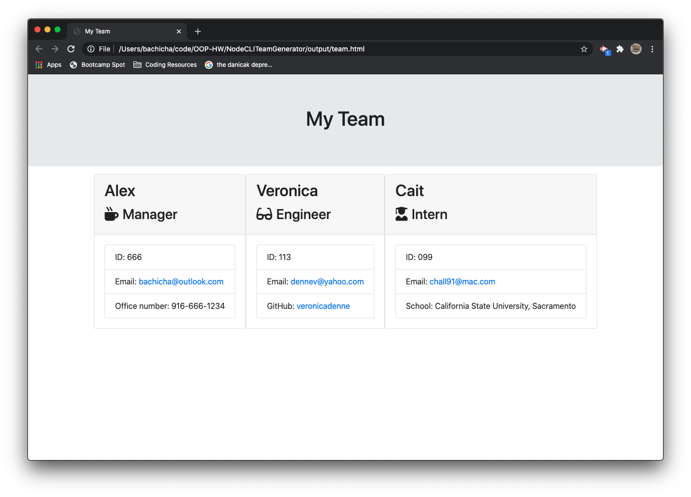

# Unit 10 Homework: Template Engine Employee Team Generator 


## Description

This Template Engine generator is a Node CLI that takes in information about employees and generates an HTML webpage that displays summaries for each person.


## Table of Contents

* [Description](#description)
* [User Story](#userstory)
* [Instructions](#instructions)
* [License](#license)


## User Story

```
As a manager
I want to generate a webpage that displays my team's basic info
so that I have quick access to emails and GitHub profiles
```


## Instructions

This application prompts the user for information about the team manager and then information about the team members. The user can input any number of team members, and they may be a mix of engineers and interns. This assignment must also pass all unit tests. When the user has completed building the team, the application will create an HTML file that displays a nicely formatted team roster based on the information provided by the user. 

* Use the [Inquirer npm package](https://github.com/SBoudrias/Inquirer.js/) to prompt the user for their email, id, and specific information based on their role with the company. For instance, an intern may provide their school, whereas an engineer may provide their GitHub username.

* Make sure to `npm install`.

The dependencies are, [jest](https://jestjs.io/) for running the provided tests, and [inquirer](https://www.npmjs.com/package/inquirer) for collecting input from the user.

* The application can be invoked by typing `node app.js`


The finished product will look something like this:




## License 


## Contributions and Questions


](https://GitHub.com/alexbachicha)
